# HudController

HudController lets you customize HUD elements and control almost any HUD or mod setting with key binds or condition-based automation in **Monster Hunter Wilds**.

## Table of contents

- [HudController](#hudcontroller)
  - [Table of contents](#table-of-contents)
  - [Installation](#installation)
  - [Quick start](#quick-start)
  - [Profile Panel](#profile-panel)
  - [HUD Options](#hud-options)
    - [General](#general)
    - [Player](#player)
    - [Npc](#npc)
    - [Monster](#monster)
    - [Quest](#quest)
    - [Seikret](#seikret)
    - [Profile](#profile)
    - [Fade](#fade)
    - [Game Options](#game-options)
  - [Menu Bar](#menu-bar)
    - [Mod](#mod)
    - [Language](#language)
    - [Custom Font](#custom-font)
    - [Bind](#bind)
      - [Key](#key)
        - [Binding](#binding)
      - [Key Options](#key-options)
      - [Condition](#condition)
        - [Condition Example](#condition-example)
        - [Available Conditions](#available-conditions)
      - [Condition options](#condition-options)
    - [User](#user)
      - [Scripts](#scripts)
      - [Conditions](#conditions)
      - [Game Options](#game-options-1)
    - [Tools](#tools)
      - [Config Manager](#config-manager)
      - [Debug](#debug)
      - [Grid](#grid)
      - [Mouse Edit](#mouse-edit)
  - [Element Profiles](#element-profiles)
  - [Elements](#elements)
    - [Common Settings](#common-settings)
      - [Element Profile](#element-profile)
      - [Main Settings](#main-settings)
    - [Item Bar](#item-bar)
    - [Ammo/Coatings Bar](#ammocoatings-bar)
    - [Weapon Information](#weapon-information)
    - [Name Display: Interactables](#name-display-interactables)
    - [Name Display: Characters \& Palicos](#name-display-characters--palicos)
    - [Custom Radial Menu](#custom-radial-menu)
    - [Damage Numbers](#damage-numbers)
    - [Melee Weapon Sharpness Gauge](#melee-weapon-sharpness-gauge)
    - [Objectives](#objectives)
    - [Health Gauge](#health-gauge)
    - [Stamina Gauge](#stamina-gauge)
    - [Chat Notification](#chat-notification)
    - [Environment Clock](#environment-clock)
    - [Keyboard Shortcuts](#keyboard-shortcuts)
    - [Minimap](#minimap)
    - [Quest End Timer](#quest-end-timer)
    - [Subtitles \& Sound](#subtitles--sound)
  - [Element Reference](#element-reference)
    - [Subtitles Choice](#subtitles-choice)
    - [Quest Prepare](#quest-prepare)
    - [Action Tutorial](#action-tutorial)
    - [Target Reticle](#target-reticle)
    - [Menu Button Guide](#menu-button-guide)
    - [Barrel Bowling Score](#barrel-bowling-score)
    - [TU3 Debuff](#tu3-debuff)
    - [TU3 Canvas](#tu3-canvas)
    - [Chat Log](#chat-log)
    - [Quest End Timer](#quest-end-timer-1)
    - [Button Press](#button-press)

## Installation
1.  Install [REFramework](https://github.com/praydog/REFramework-nightly/releases).
2.  Extract the **HudController** archive into your **Monster Hunter Wilds** game
    directory.

## Quick start
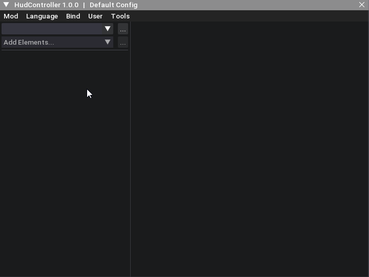

## Profile Panel
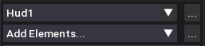

- **Profile Selector:** Lists all available HUD profiles.
- **Element Selector:** Lists all elements that can be edited by the mod.
- **...:** Opens additional actions for the selected profile or element.

### Profile Actions
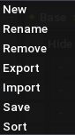

- **New:** Creates a new profile.
- **Rename:** Renames the current profile.
- **Remove:** Removes the current profile.
- **Export:** Copies the current profile as JSON to the clipboard.
- **Import:** Creates a new profile from JSON in the clipboard.
- **Save:** Saves the configuration and creates a backup. The configuration is also saved automatically after each action.
- **Sort:** Opens the Profile Sorter.

### Element Actions
- **Sort:** Sorts elements alphabetically.

## HUD Options
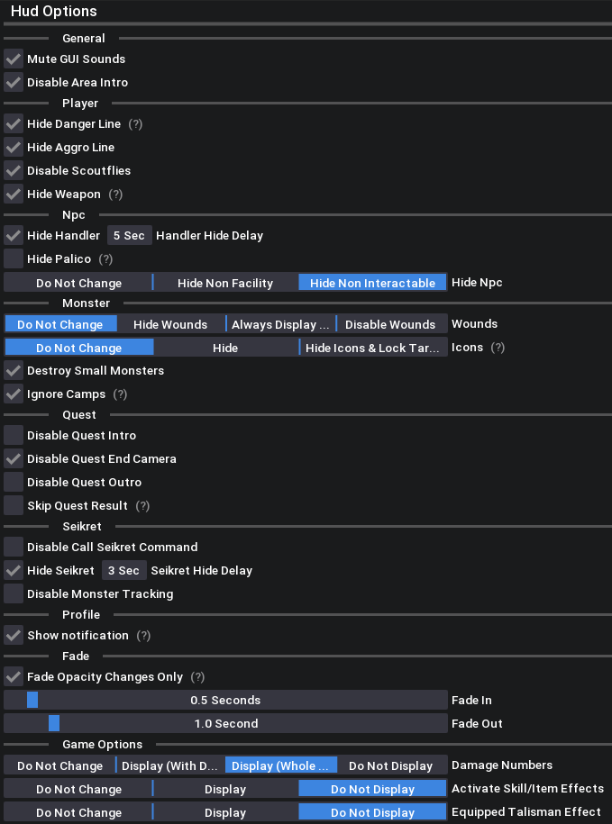

### General
- **Mute GUI Sounds:** Mutes all GUI sounds.
- **Disable Area Intro:** Hides fade in with area name that appears when you visit an area for the first time.

### Player
- **Hide Danger Line:** Hides red line indicating fatal attack.
- **Hide Aggro Line:** Hides red line toward the targeted player.
- **Disables Scoutflies:** Hides all scoutflies effects.
- **Hide Weapon:** Hides weapon when not drawn.

### Npc
- **Hide Handler:** Hides the Handler after you leave interaction range for the duration specified by **Handler Hide Delay**.
- **Handler Hide Delay:** Sets how long the Handler remains visible before being hidden.
- **Hide Palico:** Hides Palico outside of quests.
- **Hide Non Facility:** Hides all non facility NPCs.
- **Hide Non Interactable:** Hides all NPCs that you can't talk to.

### Monster
- **Hide Wounds:** Hides all wound effects.
- **Always Display Wounds:** Wound effects are always visible.
- **Disable Wounds:** Disables wounds, except weak points.
- **Hide Monster Icons:** Hides monster icons, unless monster is paintballed.
- **Hide Lock Target:** Disables Lock Target and tracking, unless monster is paintballed.
- **Destroy Small Monsters:** Removes all small monsters. Disabling this option and reloading the map will make them reappear.
- **Ignore camps:** Monsters ignore camps and camps cannot be destroyed.

### Quest
- **Disable Quest Intro:** Hides 'Quest Begin' intro.
- **Disable Quest End Camera:** Disables monster focus camera thing at the end of a quest.
- **Disable Quest Outro:** Skips Quest End animations.
- **Skip Quest Result:** Skips the quest result sequence. You still receive all rewards. Also skips the Barrel Bowling results.

### Seikret
- **Disable Call Seikret Command:** Disables all call commands.
- **Hide Seikret:** Hides the Seikret after you leave interaction range for the duration specified by **Seikret Hide Delay**. Calling it makes it reappear.
- **Seikret Hide Delay:** Sets how long the Seikret remains visible before being hidden.
- **Disable Monster Tracking:** Disables monster tracking.

### Profile
- **Show Notification:** Show notification when switching to this profile.

### Fade
**Fade** is applied when switching profiles. The current profile's HUD elements gradually fade out by reducing their opacity each frame until they reach 0%. The new profile is then applied, and its HUD elements gradually fade in by increasing their opacity each frame until they reach 100%.

- **Fade In:** Fade in time.
- **Fade Out:** Fade out time.
<a id="hud-options-fade-opacity"></a>
- **Fade Opacity Changes Only** Applies fade only to elements whose opacity differs between two profiles.

<a id="hud-options-game-options"></a>

### Game Options
Contains game settings added at [**User > Game Options**](#user-game-options).

## Menu Bar
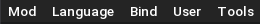

### Mod
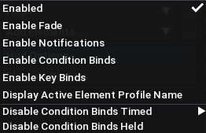

- **Enabled:** Enables or disables the mod.
- **Enable Fade:** Enables profile transition fades.
- **Enable Notifications:** Enables profile-switching notifications.
- **Enable Condition Binds:** Enables condition binds.
- **Enable Key Binds:** Enables key binds.
- **Display Active Element Profile Name:** Displays the active element profile's name alongside the element name.
- **Disable Condition Binds Timed:** Disables condition binds for a specified number of seconds after a HUD key bind is pressed.
- **Disable Condition Binds Held:** Disables condition binds while a HUD key bind is held.

### Language
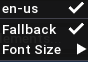

Contains all language files located in `MonsterHunterWilds\reframework\data\HudController\lang`.

- **Fallback:** Uses the English message if a message is missing from the selected language file.
- **Font Size:** Adjusts the text size.

Some text, such as HUD element names, is translated by the game and follows its language setting.

To provide your own translation for other text:

1. Navigate to `MonsterHunterWilds\reframework\data\HudController\lang`.
2. Copy `en-us.json` and rename the copy.
3. Translate the strings in the copied file.
4. Reset the scripts.
5. Your translation should now appear in the **Language** menu.

### Custom Font

To use a different font, specify its filename in the language JSON file:

```json
"_font": {
    "name": "NotoSans-Bold.ttf"
}
```

Font has to be located at `\MonsterHunterWilds\reframework\fonts` directory.

### Bind
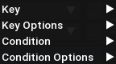

Almost all options of HUD profile, element or general mod settings can be changed through a bind.

#### Key
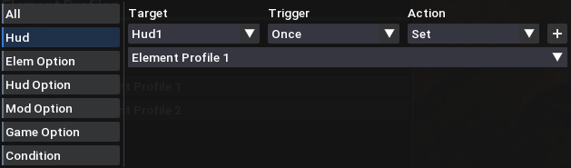

Only one HUD profile can be bound to a specific key combination. Multiple options can share the same key combination, as long as they are unique.

- **All:** Lists all key binds.
- **Hud:** Bind HUD profiles.
- **Elem Option:** Bind element options.
- **Hud Option:** Bind HUD options.
- **Mod Option:** Bind mod options.
- **Game Option:** Bind game options added through [**User > Game Options**](#user-game-options).
- **Condition:** Bind keys used in [**Key Bind**](#condition-rule-conditions-key-bind) condition under [**Bind Condition**](#condition).

##### Binding
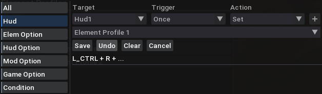

- **Target:** Option to bind.
- **Trigger:**
  - **Once:** Triggers once.
  - **Repeat:** Triggers every frame.
- **Action:**
  - **Set:** Sets the option to the selected value.
  - **Set Hold:** Sets the option while the key bind is held, then restores its original value when released.
- **Option Selector:** Value to set.
- **+:** Starts the key listener.
- **Save:** Saves the key bind.
- **Undo:** Removes the last key.
- **Clear:** Removes all keys.
- **Cancel:** Stops the key listener.

> **Note:** Key binds take priority over [condition binds](#condition). When a key bind uses the **Repeat** trigger, it writes its selected value every frame, overriding values set by [condition binds](#condition). If multiple [condition binds](#condition) rules attempt to set the same option, only the first matching rule is applied.

#### Key Options
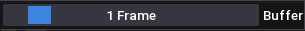

- **Buffer:** Sets the time window used to detect key combinations (e.g., `A+B`) before triggering individual keys.

#### Condition
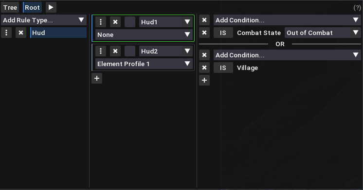

The Condition window displays condition bind rules in a tree structure, similar to a file explorer. Rules can contain child rules, which are evaluated only if their parent rule passes.

Rules are evaluated from top to bottom. If a parent and its child both pass and set the same option, the child's value takes precedence.

<a id="condition-rule-hud"></a>
**HUD rules with [element profiles](#element-profiles):** Multiple HUD rules can trigger at the same time if they target the same HUD profile. Their element profiles are collected in trigger order.

- **Rule Types:** Lists available condition types. Drag rule types to change their order.
- **Rules:** Lists rules of the selected type. Drag rules to change their order.
- **+:** Adds a new rule.
- **Rule Target:** Option to modify.
- **Rule Option:** Value to apply when the rule triggers.
- **Rule Checkbox:** When enabled, restores the original value when the rule stops triggering.
- **Conditions:** Displays the conditions configured for the selected rule.
- **IS/NOT:** Negates the selected condition.
- **+:** Adds a new OR group.

##### Condition Example
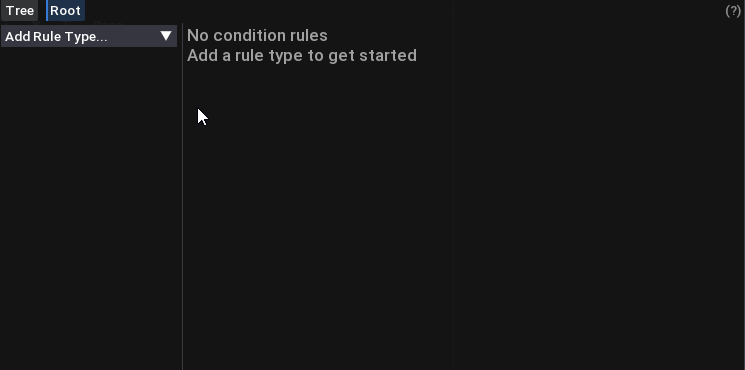

##### Breadcrumbs


Each rule behaves like a folder in a file explorer. A rule can only be opened if it contains at least one condition. Opened rules can contain child rules.

- **Arrows:** Opens a list of sibling rules to navigate between them.
- **Breadcrumbs:** Click a parent rule to return to it.

##### Tree
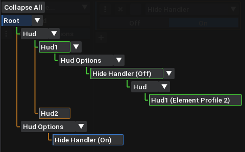

<a id="condition-rule-colors"></a>
**Colors:**
- **Green:** Rule is triggering.
- **Brown:** Rule is triggering but is overridden by another rule.
- **Red:** Rule is invalid.
- **Blue:** Rule is selected.

If any rule is invalid, no rules are evaluated.

Tree nodes work like breadcrumbs. Click a node to navigate to its child rules.

##### Available Conditions

- Always
- Health Changed
- Health Threshold
- Ammo Changed
- Stamina Changed
- Stamina Threshold
- Sharpness Changed
- Sharpness Color
- Weapon Drawn
- Weapon Type
- Weapon
- Riding
- Village
- Tent Area
- Minimap State
- Map Open
- Combat State
- Quest Rank
- Quest Target
- Quest
- Game Mode
- Stage
- HUD
<a id="condition-rule-conditions-key-bind"></a>
- Key Bind

#### Condition options
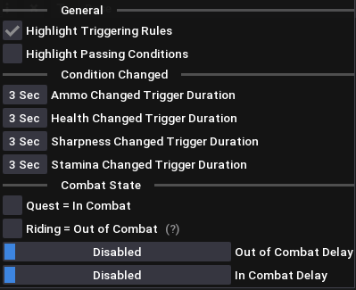

<a id="condition-options-general"></a>
##### General
- **Highlight Triggering Rules:** Highlights triggering rules in [various colors](#condition-rule-colors) depending on rule state.
- **Highlight Passing Conditions:** Highlights passing conditions in green.

##### Condition Changed
Duration of the trigger for ***Something* Changed** conditions.

##### Combat State
Contains options for the ***Combat State*** condition.

- **Quest = In Combat:** The ***In Combat*** state always triggers during a quest.
- **Riding = Out of Combat:** The ***In Combat*** state won't trigger while riding, unless it was already triggered.
- **Out of Combat Delay:** Delays triggering the ***Out of Combat*** state by the specified amount of time.
- **In Combat Delay:** Delays triggering the ***In Combat*** state by the specified amount of time.

### User
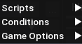

<a id="user-scripts"></a>

#### Scripts
Contains all **.lua** files in `MonsterHunterWilds\reframework\data\HudController\user_scripts` whose names do not start with an underscore (`_`) or contain the word `example`. Example scripts are included in this folder by default. If anything is unclear, feel free to ask.

After enabling or disabling a script, you must reset the scripts for the changes to take effect. Scripts that require a reset are displayed in *yellow*. Scripts that fail to load are displayed in *red*, with the error message shown in their tooltip.

How is this different from placing scripts in the **autorun** folder? The main difference is that your script selection is saved in the config, and all scripts are loaded only after the mod has fully initialized. Otherwise, it works the same way.

<a id="user-conditions"></a>

#### Conditions
The same rules apply to conditions, but they use a different folder: `MonsterHunterWilds\reframework\data\HudController\user_conditions`.

If a condition loads successfully, it appears in the condition dropdown under [**Bind > Condition > Add Condition...**](#condition). Its options, if implemented, appear under [**Bind > Condition Options**](#condition-options).

<a id="user-game-options"></a>

#### Game Options
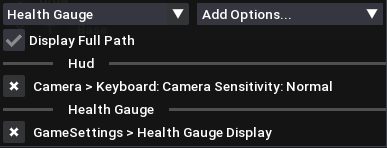

Here you can register game options for [**HUD profiles**](#game-options) or individual [elements](#common-settings-game-options). Once registered, these options become available to bind under [Bind > Key](#key) or [Bind > Condition](#condition).

- **Display Full Path:** Displays full path to the option instead of just option name.

### Tools
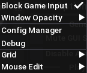

- **Block Game input:** Blocks game input while the mod window is open.
- **Window Opacity:** Adjusts the mod window opacity.

#### Config Manager
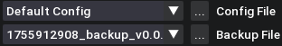

> **Note:** Switching config files requires a script reset.

- **Config File:** Lists available config files.
- **Backup File:** Lists available backup files.
- **...:** Opens additional actions for the selected file.

##### Config File Actions
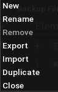

- **New:** Creates an empty config.
- **Rename:** Renames the current config.
- **Remove:** Moves the current config to the recycle bin.
- **Export:** Copies the current config as JSON to the clipboard.
- **Import:** Creates a new config from JSON in the clipboard.
- **Duplicate:** Duplicates the current config.
- **Close:** Closes the **Config Manager**.

##### Backup File Actions
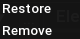

- **Restore:** Moves the backup to `MonsterHunterWilds\reframework\data\HudController` and makes it available in the **Config File** dropdown.
- **Remove:** Moves the backup to the recycle bin.

#### Debug
Contains the tools used to develop the mod. If you have any questions, feel free to ask.

#### Grid
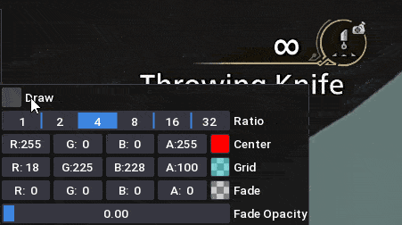

#### Mouse Edit
Mouse Edit lets you edit basic element options using the mouse.

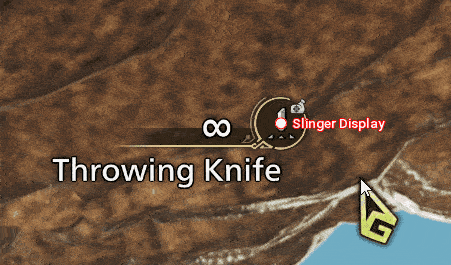
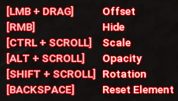
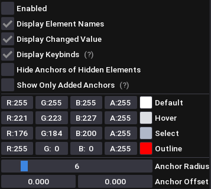

- **Enabled:** Enables Mouse Edit.
- **Display Element Names:** Displays element names beside their anchors.
- **Display Changed Value:** Displays the current value when changed.
- **Display Keybinds:** Displays Mouse Edit key binds, which can be moved with the mouse.
- **Hide Anchors of Hidden Elements:** Hides anchors of hidden elements.
- **Anchor Radius:** Adjusts the radius of anchors.
- **Anchor Offset:** Adjusts the offset of anchors.

## Element Profiles
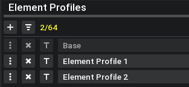

Each element profile is available to all elements but must be enabled for each element individually. You can create up to 64 profiles. The order of element profiles is important.

When multiple profiles are triggered by a [**Key Bind**](#key) or [**Condition Bind**](#condition), they are applied in reverse order. If a bind triggers Element Profile 1 and Element Profile 2, and an element has both enabled, Element Profile 2 takes precedence. [Bind trigger order](#condition-rule-hud) also matters.

If a bind doesn't trigger any element profiles, all elements revert to their default profile. The default profile is also applied whenever you switch HUD profiles manually.

- **T:** Renames a profile.

## Elements
Some elements contain child elements with their own settings, which are not listed here.

### Common Settings
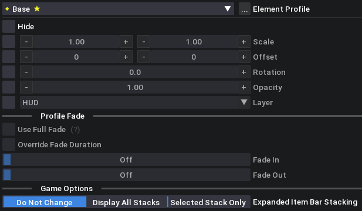

<a id="common-settings-element-profiles"></a>

#### Element Profile
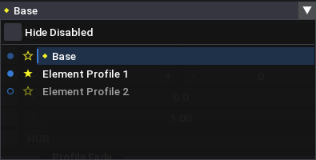

- **Hide Disabled:** Hides disabled profiles.
- **Circle:** Enables or disables a profile for the element.
- **Star:** Marks the default profile.
- **Diamond:** Indicates the currently active profile.
- **Blue Highlight:** Indicates the currently selected profile.
- **...:** Opens additional actions for the selected element profile.

##### Element Profile Actions
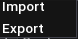

- **Import:** Imports settings from JSON in the clipboard.
- **Export:** Copies the current profile's settings as JSON to the clipboard.

#### Main Settings

- **Hide:** Hides the element.
- **Scale:** Scales the element. Set the X or Y scale to a value below 0 to flip the element horizontally or vertically.
- **Offset:** Moves the element from its original position.
- **Rotation:** Rotates the element.
- **Opacity:** Sets the element's transparency.
- **Layer:** Defines the element's stacking order. Elements with higher layer values appear above those with lower values. Layers in the dropdown are ordered from lowest to highest.

#### Profile Fade
Disabled unless [**Fade**](#fade) in [**HUD Options**](#hud-options) is enabled.

- **Use Full Fade:** Fades the element out completely before switching profiles, then fades it back in. Overrides [opacity-only fading](#hud-options-fade-opacity).
- **Override Fade Duration:** Enables the **Fade In** and **Fade Out** sliders.
- **Fade In:** Sets the fade-in duration.
- **Fade Out:** Sets the fade-out duration.

<a id="common-settings-game-options"></a>

#### Game Options
Contains game settings added under [**User > Game Options**](#user-game-options).

### Item Bar
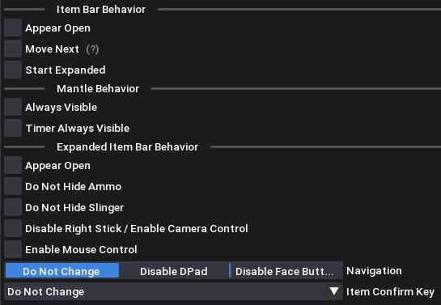

#### Item Bar Behavior

- **Appear Open:** Keeps the item bar in its open state instead of its icon state when closed.
- **Move Next:** Moves to the next item if the current slot is empty after use.
- **Start Expanded:** Starts with the item bar expanded.

#### Mantle Behavior

- **Always Visible:** Keeps the mantle visible while the Expanded Item Bar is open.

#### Expanded Item Bar Behavior

- **Appear Open:** Keeps the Expanded Item Bar visible and faded out when closed.
- **Do Not Hide Ammo:** Keeps ammo visible while the Expanded Item Bar is open.
- **Do Not Hide Slinger:** Keeps the slinger visible while the Expanded Item Bar is open.
- **Disable Right Stick / Enable Camera Control:** Disables right-stick navigation and restores camera control.
- **Enable Mouse Control:** Enables mouse-based item selection and item confirmation with the left mouse button.
- **Navigation:** Pad only. Disables either D-pad or face-button navigation.
- **Item Confirm Key:** Pad only. Changes the item confirmation key bind.

### Ammo/Coatings Bar
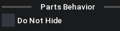

#### Parts Behavior

Applies to Energy, Special Ammo, and Phials.

- **Do Not Hide:** Keeps these parts visible while the Item Bar is open.

### Weapon Information
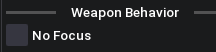

#### Weapon Behavior

- **No Focus:** Prevents the weapon information from changing scale when the Item Bar is open.

### Name Display: Interactables
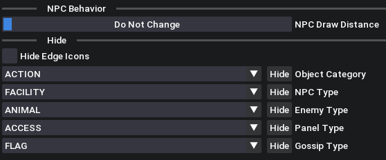

#### NPC Behavior

- **Draw Distance:** Hides NPC interactables when the distance between the player and the NPC exceeds the specified value.

#### Hide

- **Hide Edge Icons:** Hides icons displayed at the edge of the screen when an object is just outside the player's view.
- **Other Options:** Controls which types of interactables are hidden.

### Name Display: Characters & Palicos
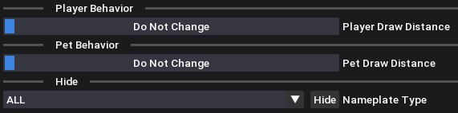

#### Player Behavior

- **Draw Distance:** Hides player and support NPC nameplates when their distance from you exceeds the specified value.

#### Pet Behavior

- **Draw Distance:** Hides Palico and Seikret nameplates when their distance from you exceeds the specified value.

#### Hide
- **Nameplate Type:** Controls which types of nameplates are hidden.

### Custom Radial Menu
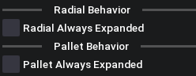

#### Radial Behavior

- **Always Expanded:** Keeps the radial menu in its expanded (focused) state.

#### Pallet Behavior

- **Always Expanded:** Keeps the pallet in its expanded (focused) state.

### Damage Numbers
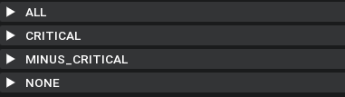

[Element profiles](#element-profiles) do not apply to Damage Numbers.

- **ALL:** Applies to all damage numbers.
- **CRITICAL:** Applies to critical damage numbers.
- **MINUS CRITICAL:** Applies to negative critical damage numbers.
- **NONE:** Applies to normal (non-critical) damage numbers.

#### Numbers Behavior
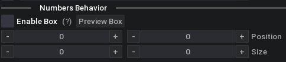

- **Enable Box:** Scales the positions of damage numbers to fit within a specified box, effectively squeezing the screen space into that area.
- **Preview Box:** Displays the specified box.
- **Position:** Adjusts the box's position.
- **Size:** Adjusts the box's size.

#### Child Elements
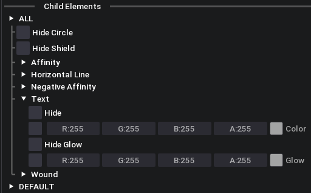

Contains all damage states, such as SHIELD and WEAK_POINT. ALL applies to all damage states.
- **Color:** Adjusts the element's color.
- **Hide Glow:** Hides the glow behind the text.
- **Glow Color:** Adjusts the glow's color.

### Melee Weapon Sharpness Gauge
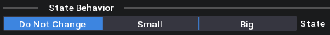

#### State Behavior

- **Small:** Keeps the Sharpness Gauge in its small, knife-like shape pointed downward.
- **Big:** Keeps the Sharpness Gauge in its big (expanded) state.

### Objectives
#### Child Elements
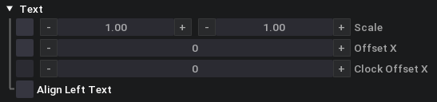

- **Offset X:** Offsets the element horizontally from its original position.
- **Clock Offset X:** Applies an additional horizontal offset when the quest clock is visible. Requires **Offset X** to be enabled.
- **Align Left:** Aligns the text to the left.

### Health Gauge
#### Child Elements
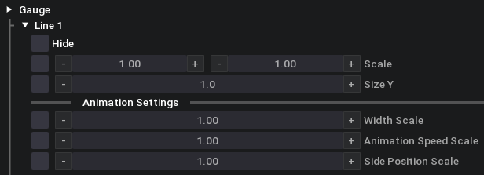

- **Size Y:** Adjusts the vertical size.
- **Width Scale:** Scales the gauge line's width.
- **Animation Speed Scale:** Scales the animation speed.
- **Side Position Scale:** Scales the vertical movement of the line ends.

### Stamina Gauge
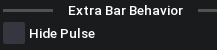
#### Extra Bar Behavior

- **Hide Pulse:** Hides the pulse effect on the stamina extra bar.

#### Child Elements
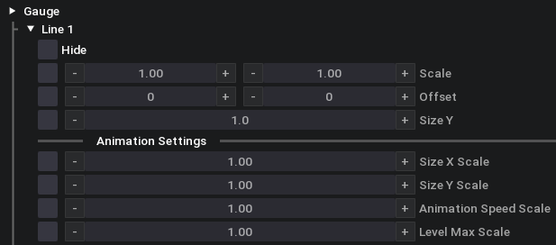

- **Size Y:** Adjusts the vertical size.
- **Size X Scale:** Scales the horizontal size.
- **Size Y Scale:** Scales the vertical size.
- **Animation Speed Scale:** Scales the animation speed.
- **Level Max Scale:** Scales the intensity of the animation.

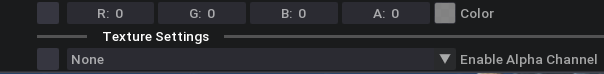

- **Color:** Adjusts the line's color.
- **Alpha Channel:** Adjusts the line's transparency. Change it to R, G, or B for a solid line.

### Chat Notification
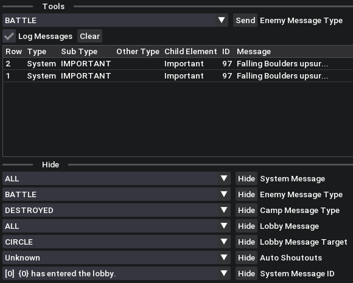

#### Tools

- **Enemy Message Type:** Sets the type of message to send.
- **Send:** Sends the specified message.
- **Log Messages:** Stores the last 50 messages and their types.
- **Clear:** Clears the message cache.

#### Hide

- **Other Options:** Controls which types of notifications are hidden.

### Environment Clock
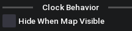

#### Clock Behavior

- **Hide When Map Visible:** Hides the clock whenever the map is open.

### Keyboard Shortcuts
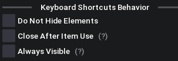

#### Keyboard Shortcuts Behavior

- **Do Not Hide Elements:** Prevents the Minimap, Environment Clock, Target Monster Icon, Slinger Display, and Mantle elements from fading out.
- **Always Visible:** Keeps Keyboard Shortcuts on screen whenever possible.
- **Close After Item Use:** Closes Keyboard Shortcuts immediately after an item is used if it is open. If it is closed, prevents the element from opening, effectively making Keyboard Shortcuts openable only with the F keys. Should be used with **Do Not Hide Elements**.

### Minimap
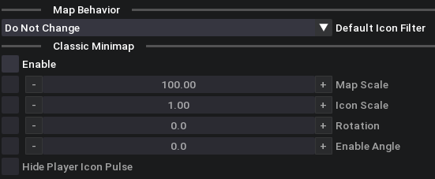

#### Map Behavior

- **Default Icon Filter:** Specifies the icon filter to apply automatically when switching to this profile.

#### Classic Minimap
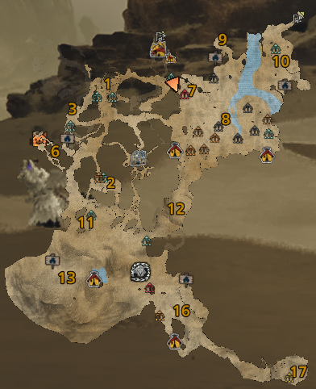

- **Map Scale:** Adjusts the minimap size.
- **Icon Scale:** Adjusts the icon size.
- **Hide Player Icon Pulse:** Disables the player icon pulse.
- **Rotation:** Adjusts the minimap's rotation.
- **Angle:** Adjusts the minimap's angle.

### Quest End Timer
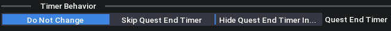

#### Timer Behavior

- **Skip Quest End Timer:** Returns from the quest immediately.
- **Hide Quest End Timer Input:** Hides the input for skipping the timer, making it unskippable.

### Subtitles & Sound


#### Tools

- **Log Subtitles:** Logs all subtitles and their types.
- **Clear:** Clears the log.
- **Log SFX:** Logs all sound effects.
- **Pause:** Pauses logging.
- **Duplicate Event Cooldown:** Prevents sounds from appearing in the log if they trigger again within the specified time.
- **Mute Game Object:** Mutes all sounds belonging to the specified Game Object.
- **Mute ID:** Mutes the specified sound.
- **Listen to Game Object**: Logs only sounds owned by specified Game Object.

#### Hide

- **Other Options:** Controls which types of subtitles are hidden.

#### Mute

- **Other Options:** Controls which types of sounds are muted.

#### Mute SFX
All muted Game Objects and sound IDs appear here.

- **Mute:** Mutes the specified Game Object or sound ID.

## Element Reference
### Subtitles Choice


### Quest Prepare


### Action Tutorial


### Target Reticle


### Menu Button Guide


### Barrel Bowling Score


### TU3 Debuff


### TU3 Canvas


### Chat Log


### Quest End Timer


### Button Press
